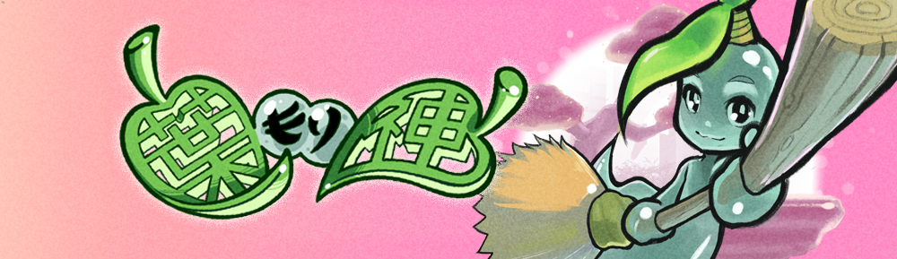

# Hamorigami GB

This game is a very short (and frustratingly difficult) gameboy game created in 10 days for the GBJAM 10. You can find it's itch.io page [here](https://punchcafe.itch.io/hamorigami-gb). If you were looking for effecient, optimised gbdk code, you've come to the wrong place.

Hamorigami GB is a gameboy adaption of the original [Hamorigami](https://bitbrain.itch.io/hamorigami), a short game for a Ludum Dare 46. You play as a Kodama, who is taking care of a little sapling. Ensure your little tree gets enough sunglight and rain (but not too much of either) and see it grow into a fully-fledged Bonsai tree.

## Download

Download from the [download section](https://punchcafe.itch.io/hamorigami-gb) on the itch.io page. This game is in the orginal Gameboy ROM format, so you'll need a flash drive or emulator to play it.

## Anything For the Future?

This game was cobbled together in 10 days from the ground up in C, so the main focus was getting something that _worked_. As a game, it would be nice to see it expanded in to something a little more playable, and potentially give it Gameboy color support, but there are no plans to do that at this time.

## The Team

💻 programming and visuals by punchcafe  
🎹 audio by k0stnix  
🔮 graphics design by CM Kevin  